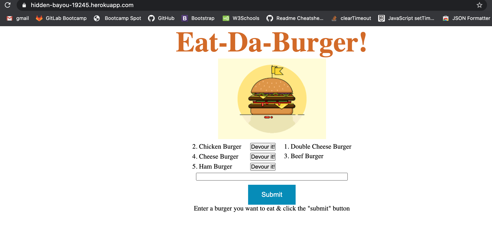

# MVC-burger-logger

### Objective
* A burger logger application with MySQL, Node, Express, Handlebars and a homemade ORM follows the MVC design pattern.
* It uses Node and MySQL to query and route data in the app, and Handlebars to generate the HTML.

### Description
* Eat-Da-Burger! is a restaurant app that lets users input the names of burgers they'd like to eat.
* Whenever a user submits a burger's name, app will display the burger on the left side of the page -- waiting to be devoured.
* Each burger in the waiting area also has a Devour it! button. When the user clicks it, the burger will move to the right side of the page.
* Storing every burger in a database, whether devoured or not.

### Table Schema
* Database schema containing a table named burgers 

### Installation
Steps to install the node npm packages
* `npm i`

### Dependencies
* mysql
* express
* express-handlebars
* orm
* Note: They already included in npm package.json

### Usage
* `git clone git@github.com:Anitha-Venkatesan/MVC-burger-logger.git`
* `cd MVC-burger-logger`
* Open server.js in Command Line Terminal using the command `MYSQL_PASSWORD=<<your mysql password goes here>> node server.js`

### Screenshots
 
 ### Heroku Deployed URL
 [Demo](https://hidden-bayou-19245.herokuapp.com/)
 
### License
* This program is licensed under the [MIT](https://choosealicense.com/licenses/mit/) license.

### References
* https://handlebarsjs.com/guide/builtin-helpers.html
* https://expressjs.com/en/guide/routing.html
* https://dzone.com/articles/http-requests-in-express-js
### Questions
* If you have any questions, Please feel free to contact me [Anitha Venkatesan](https://github.com/Anitha-Venkatesan) on my email anithamca68@gmail.com

* You can also create [issues](https://github.com/Anitha-Venkatesan/MVC-burger-logger/issues) on my repo.

